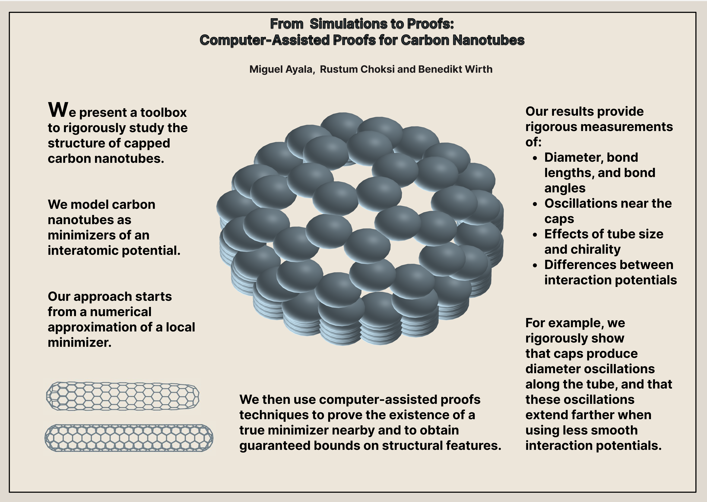

# NanotubesCAPs

This repository contains the Julia codes associated with the paper: "On the Structure of Carbon Nanotubes: 
Results from Computer-Assisted Proofs " by M Ayala, R Choksi and B Wirth.

 [🔗 arXiv:2506.22614](https://arxiv.org/abs/2506.22614)   

## Abstract
We present a toolbox based on computer-assisted proofs to rigorously study the structure of capped carbon nanotubes. We model nanotubes as minimizers of an interatomic potential. 
Numerical simulations and validated computations produce rigorous mathematical results about atomic distances and structural variations. In particular, we rigorously measure the diameter, bond lengths, and bond angles of nanotubes and thereby precisely quantify oscillations near the caps, differences between interaction potentials, and effects of nanotube size or chirality. 
As an example, we observe that the caps induce diameter oscillations along the tube (rather than a monotonous diameter equilibration) with increasing spatial extent for less smooth interaction potentials.

 
